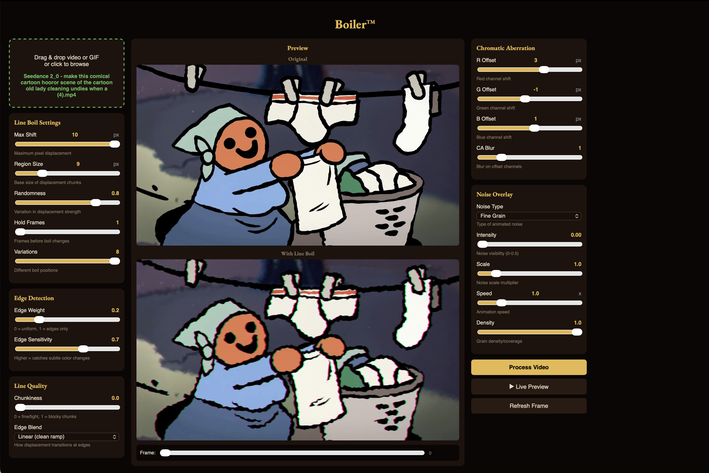

# ZohoBoil

> A desktop app that gives any video the wobbly, hand-drawn "line boil" of traditional animation. Drop a clip in, drag a few sliders, export.



---

## Download (no coding required)

1. Go to the **[Releases page](../../releases/latest)** and download `ZohoBoil.app.zip`.
2. Unzip it. Drag `ZohoBoil.app` into your **Applications** folder.
3. **First launch:** right-click the app → **Open** → **Open** again. (macOS warns about apps from unidentified developers — this is expected. You only need to do this once.)
4. Drop a video or GIF into the window. Play with the sliders. Click **Process Video**, then **Download**.

That's it. No Python, no Terminal, no Homebrew. ffmpeg is bundled inside the app.

> **System requirements:** macOS on Apple Silicon (M1/M2/M3/M4). Intel Macs are not yet supported.

---

## What it does

ZohoBoil takes a flat, clean video and gives every edge a subtle (or aggressive) wobble — the kind of wiggle you see in hand-drawn animation when the artist re-draws each frame slightly differently. You can also stack:

- **Chromatic aberration** — split the red/green/blue channels for a VHS / old-film look
- **Noise overlays** — fine grain, coarse grain, TV static, Perlin noise, scanlines
- **Edge detection weighting** — concentrate the wobble on color edges only, or let it ripple across the whole frame
- **Live preview** — scrub a frame or play an animated preview while you tweak the sliders

Original audio is preserved on export.

---

## Walkthrough

**1. Drop a video.** Drag any `.mp4`, `.mov`, `.gif`, or other common format onto the dashed box in the top-left. The preview shows your file on top, the boiled version below.

**2. Set the wobble.** Under **Line Boil Settings**:
- *Max Shift* — how many pixels each edge can wander
- *Region Size* — how big the wobbling chunks are
- *Randomness* — variation in wobble strength
- *Hold Frames* — how long each "drawing" is held before the boil shifts
- *Variations* — how many distinct boil positions cycle through

**3. (Optional) Edge focus.** Under **Edge Detection**, push *Edge Weight* toward 1.0 to make the boil cling to color edges only. Lower it for a uniform ripple across the frame.

**4. (Optional) Color split + grain.** The right panel adds **Chromatic Aberration** (R/G/B offsets, with a CA Blur for softness) and **Noise Overlay** (pick a noise type, dial in intensity).

**5. Preview.** Click **▶ Live Preview** to see the result animated. Move sliders and it auto-refreshes.

**6. Export.** Click **Process Video**, watch the progress bar, then **Download** to save the finished `.mp4` anywhere on your Mac.

---

## Why "Boil"?

In traditional animation, "boiling lines" refers to the natural wobble that happens because every frame is drawn by hand and never quite matches the last one. Modern digital animation looks clean and dead — ZohoBoil puts the life back.

---

## For developers — build from source

You only need this section if you want to modify the code or compile the app yourself.

Requires Python 3.11+ and (optionally) ffmpeg on `PATH` for development mode.

```bash
git clone https://github.com/princezoho/zohoboil.git
cd zohoboil
python3 -m venv venv
source venv/bin/activate
pip install -r requirements.txt

# Web mode (opens in your browser):
python3 app.py
# → http://localhost:5050

# Desktop mode (opens a native window):
python3 desktop_app.py
```

To rebuild the distributable `.app`:

```bash
pip install pyinstaller pywebview
pyinstaller ZohoBoil.spec --noconfirm
# → dist/ZohoBoil.app
```

### Project layout

```
app.py              Flask server + all video processing
desktop_app.py      pywebview wrapper for the desktop build
ZohoBoil.spec       PyInstaller build config
ZohoBoil.icns       App icon
bin/ffmpeg          Bundled ffmpeg binary (arm64)
docs/               Screenshots and assets for the README + landing page
```

---

## License

[MIT](LICENSE) — do whatever you want, just keep the copyright notice.

The bundled `ffmpeg` binary is distributed under the **GNU GPL 2+** (see [`bin/README.md`](bin/README.md)). The ZohoBoil source code itself remains MIT.

---

Built by [princezoho](https://github.com/princezoho).
